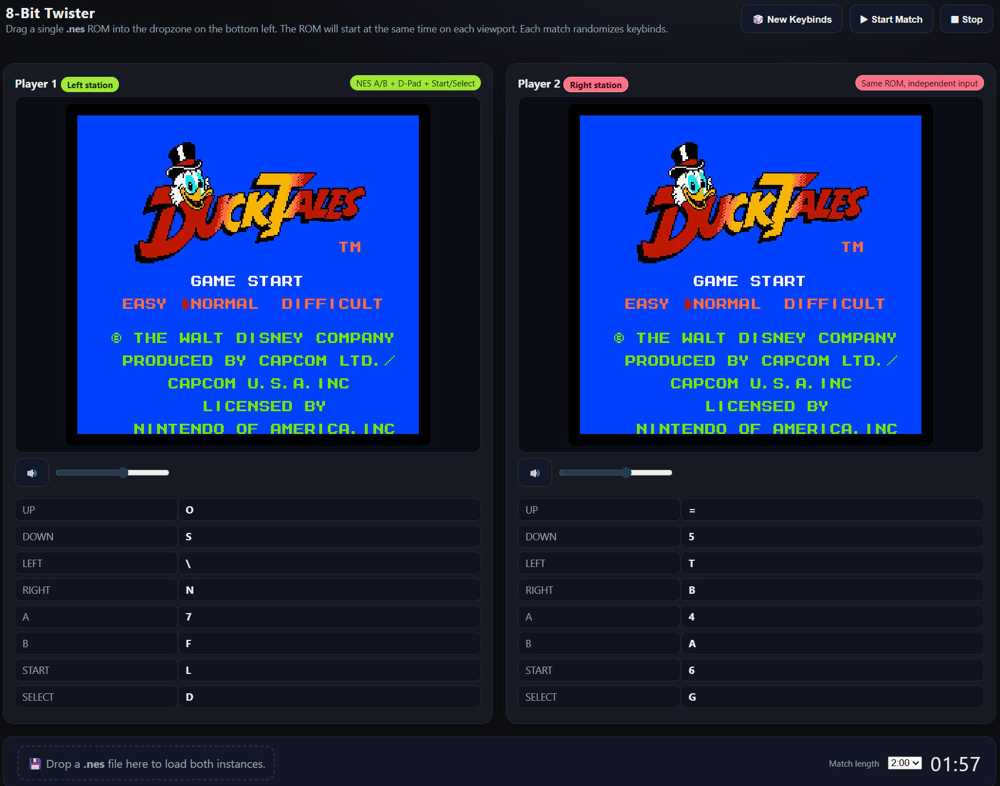

# 8-Bit Twister

> **Twister for your fingers.** Two NES games side-by-side, one keyboard, and **randomized keybinds** every round. Can you out-contort your opponent before the timer hits zero?

## Why it’s awesome

* 🎮 **Two emulators at once** — same ROM boots in both panes for a fair race.
* 🎲 **New keybind chaos each round** — 8 random keys per player, shown under each screen.
* 🕐 **Match timer + end screen** — race the clock; decide the winner on score/progress.
* 🧲 **Drag & drop** — drop a `.nes` file to start instantly (click-to-choose also works).
* 🧱 **100% client-side** — no server, no build tools; host anywhere (GitHub Pages, Nginx, etc.).

> Designed for parties, meetups, and “you’ve got five minutes, prove it” showdowns.

---

## How to play (quick start)

1. **Open the site** (local file or hosted page).
2. **Drop a `.nes` ROM** onto the big dropzone (or click it to choose).
3. Review your **random key legends** under each screen.
4. Hit **Start Match** → timer begins.
5. At **time up**, compare progress/score and crown your champion. 👑

> Legal note: Use homebrew or ROMs you’re legally allowed to use. This project ships without ROMs.

---

## Controls (by default)

* **Randomized per round** — each player gets 8 unique keys:

  * D-Pad: Up / Down / Left / Right
  * **A**, **B**, **Start**, **Select**
* The current keys for each are printed in the legend beneath each emulator.

---

## Local setup

No tooling needed. Just open `index.html`, or serve the folder for best drag-and-drop behavior.

## Credits

* Emulator: **JSNES** (JavaScript NES emulator)
* Concept & implementation: **segaboy** (8-Bit Twister)

---

## License

MIT — do what you want, have fun, give credit. And stretch those fingers first. 🖐️💥
